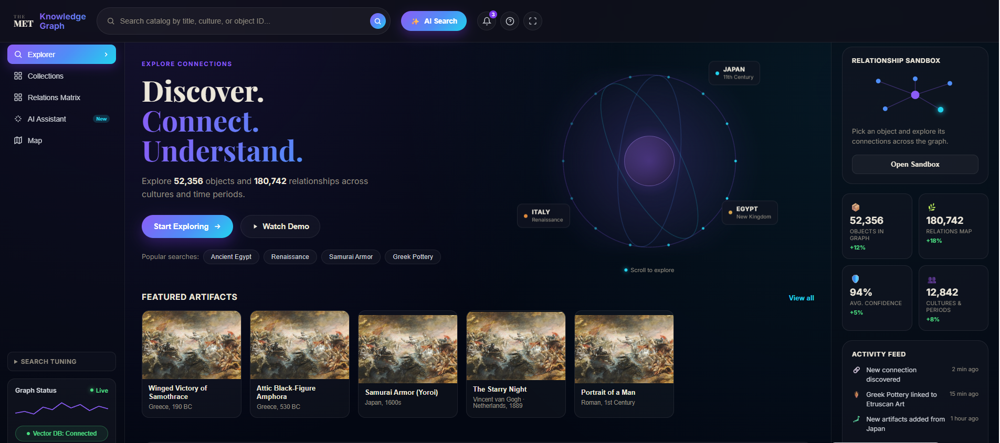

# MetLinkPrediction

MetLinkPrediction is an end-to-end cultural heritage link prediction project built on the Metropolitan Museum of Art Open Access dataset. The project combines data cleaning, local LLM-based metadata enrichment, semantic embeddings, FAISS similarity search, heterogeneous knowledge graph construction, graph-based features, XGBoost link prediction, fuzzy temporal reasoning, and an interactive curator-facing dashboard.

The main goal is to suggest potentially related museum objects even when the relationship is not explicitly stored in the original metadata. The system uses textual similarity, structured metadata, graph topology, temporal uncertainty, and explainable AI outputs to support object discovery.

## Application Screenshot



The screenshot above shows the React web application for exploring the MET knowledge graph. The interface includes catalog search, AI search, graph exploration, relationship statistics, featured artifacts, and a relationship sandbox for inspecting object connections.

## Project Overview

The pipeline starts from the raw `MetObjects.txt` dataset and produces a complete set of artifacts for training and serving a link prediction model:

- cleaned and normalized MET object metadata,
- a representative 50,000-object sample,
- enriched fields generated through deterministic extraction and local LLM inference,
- text embeddings and a FAISS index,
- a heterogeneous object-attribute knowledge graph,
- positive and negative object pairs for supervised learning,
- graph topology and Node2Vec features,
- an XGBoost classifier with monotonic constraints,
- fuzzy temporal matching features,
- evaluation and diagnostic reports,
- a Streamlit dashboard and a React/FastAPI web application.

## Repository Structure

```text
.
|-- 01_preprocessing.py
|-- 02_ollama_extraction.py
|-- 03_sample_dataset.py
|-- 04_build_embeddings.py
|-- 05_build_graph.py
|-- 06_link_prediction.py
|-- 07_fuzzy_temporal.py
|-- 09_dashboard_app.py
|-- 10_calibration_check.py
|-- 11_check_separability.py
|-- 12_precompute_dashboard_cache.py
|-- dashboard_cache.py
|-- dashboard_core.py
|-- graph_features.py
|-- fast_assemble_cache.py
|-- precompute_explanations.py
|-- docs/
|-- graph/
|-- embeddings/
|-- link_prediction/
|-- fuzzy/
`-- webapp_mus/
```

## Pipeline

```text
MetObjects.txt
   |
   v
01_preprocessing.py
   |
   v
met_clean.csv
   |
   v
03_sample_dataset.py
   |
   v
met_sample_50000.csv
   |
   v
02_ollama_extraction.py
   |
   v
met_with_extracted_info.csv
   |
   +-------------------------+
   |                         |
   v                         v
04_build_embeddings.py   05_build_graph.py
   |                         |
   v                         v
embeddings/              graph/
   |                         |
   +-----------+-------------+
               |
               v
        graph_features.py
               |
               v
        06_link_prediction.py
               |
               v
        07_fuzzy_temporal.py
               |
               v
        dashboard_core.py
               |
               v
 Streamlit dashboard / FastAPI + React app
```

## Main Components

### 1. Data Preprocessing

`01_preprocessing.py` loads the raw MET dataset and keeps only the fields needed by the downstream pipeline. It normalizes missing values, removes unusable rows, preserves numeric date fields, and creates a compact `Description` field used for embeddings.

Important preprocessing choices:

- `Object Begin Date` and `Object End Date` are preserved for temporal reasoning.
- Rows are dropped only when both `Title` and `Object Name` are missing.
- Placeholder values such as `Unknown`, `unidentified`, and `N/A` are treated as missing.
- Duplicate descriptions are flagged because identical text can artificially inflate semantic similarity.
- A `has_sparse_metadata` flag marks objects with very limited structured information.

Output:

```text
met_clean.csv
```

### 2. Representative Sampling

`03_sample_dataset.py` creates a 50,000-object working sample. Instead of using naive random sampling, it removes duplicate descriptions, scores rows by metadata quality, filters very sparse rows, and performs stratified sampling over `Classification`.

This keeps the sample large enough for meaningful experiments while still practical for local processing.

Output:

```text
met_sample_50000.csv
```

### 3. Local LLM Metadata Extraction

`02_ollama_extraction.py` enriches the dataset using a local Ollama model. The implementation avoids unnecessary LLM calls by using a fast deterministic path whenever the information already exists in structured metadata.

The script fills:

- `material`,
- `year`,
- `object_type`,
- `culture`.

Only missing culture values with enough contextual description are sent to the local LLM. The script supports concurrent requests, retries, checkpointing, and resumable processing.

Default LLM:

```text
llama3.1
```

Output:

```text
met_with_extracted_info.csv
```

### 4. Semantic Embeddings and FAISS Search

`04_build_embeddings.py` turns each object description into a dense vector using an Ollama embedding model. The vectors are saved as NumPy arrays and indexed with FAISS for fast nearest-neighbor search.

Default embedding model:

```text
nomic-embed-text
```

The FAISS index uses inner product over L2-normalized vectors, which is equivalent to cosine similarity.

Outputs:

```text
embeddings/embeddings.npy
embeddings/embedding_object_ids.json
embeddings/met.faiss
```

### 5. Knowledge Graph Construction

`05_build_graph.py` builds a heterogeneous knowledge graph. Instead of directly connecting every pair of objects that share a value, the graph uses attribute hubs:

```text
obj:123 --has_artist--> has_artist:Artist Name
obj:456 --has_artist--> has_artist:Artist Name
```

This avoids creating huge object-object cliques and keeps the graph scalable. The graph contains object nodes and hubs for artists, departments, cultures, classifications, and tags.

The same script also samples positive candidate pairs for link prediction. Positive pairs are generated from specific shared hubs such as artist and tag, while broad categories such as culture and classification are not used as direct positive-label evidence.

Outputs:

```text
graph/graph.graphml
graph/candidate_pairs.csv
graph/graph_stats.json
```

Current graph summary:

```json
{
  "object_nodes": 50000,
  "hub_nodes": 17513,
  "total_edges": 271140,
  "candidate_positive_pairs_sampled": 32154,
  "unique_object_pairs_after_dedup": 32054
}
```

### 6. Graph Features and Node2Vec

`graph_features.py` computes additional structural features for object pairs:

- `common_neighbors`,
- `jaccard`,
- `adamic_adar`,
- `preferential_attachment`,
- `node2vec_similarity`.

A key design choice is leakage prevention. Since artist and tag hubs are used to create positive training labels, they are excluded from the topology feature sets and from the Node2Vec training graph. This prevents the model from simply learning the rule that generated the labels.

Node2Vec embeddings are cached locally under `cache/`, but the cache is not meant to be committed because it can be regenerated.

### 7. Link Prediction Model

`06_link_prediction.py` trains an XGBoost classifier to estimate whether two objects are related.

Positive examples come from the graph candidate pairs. Negative examples are sampled randomly, while avoiding pairs that secretly share artist or tag identities.

Model features:

```text
cosine_similarity
shared_culture
shared_department
year_gap
common_neighbors
jaccard
adamic_adar
preferential_attachment
node2vec_similarity
```

The model uses monotonic constraints. For example, higher semantic similarity or stronger graph evidence should not reduce the link probability, while a larger year gap should not increase it.

Current evaluation:

```json
{
  "roc_auc": 0.9676,
  "n_train": 51286,
  "n_test": 12822,
  "confusion_matrix": [[5957, 454], [714, 5697]]
}
```

The strongest feature is `cosine_similarity`, followed by graph-based signals such as `adamic_adar`.

Outputs:

```text
link_prediction/link_prediction_dataset.csv
link_prediction/link_predictor.joblib
link_prediction/evaluation.json
```

### 8. Fuzzy Temporal Reasoning

`07_fuzzy_temporal.py` improves the temporal representation of object pairs. Museum dates are often uncertain ranges, so a simple midpoint difference can lose important information.

The fuzzy temporal score compares two date ranges:

```text
[a_begin, a_end]
[b_begin, b_end]
```

If the ranges overlap, the temporal membership score is `1.0`. If they do not overlap, the score decays smoothly using a Gaussian-style function controlled by a tolerance value.

The script performs an ablation study comparing:

- raw `year_gap`,
- `fuzzy_temporal_membership`,
- both temporal features together.

Current results:

```json
{
  "raw_year_gap_only": 0.9676,
  "fuzzy_temporal_only": 0.9674,
  "both_temporal_features": 0.9676
}
```

### 9. Diagnostics

The project includes two diagnostic scripts:

- `10_calibration_check.py` checks whether predicted probabilities are well behaved or saturate near 1.0.
- `11_check_separability.py` compares cosine similarity distributions for positive and negative pairs to see whether the classifier is learning a real separation in embedding space.

These diagnostics are useful because ROC-AUC measures ranking quality, not probability calibration.

### 10. Dashboard and Web Application

The project includes both a Streamlit dashboard and a React/FastAPI web application.

Core backend logic is implemented in `dashboard_core.py`. It loads metadata, embeddings, the trained model, and graph features, then returns related objects for a selected query object.

The dashboard supports:

- object search,
- related object recommendations,
- predicted link probabilities,
- on-demand relationship explanations,
- cached explanations,
- graph exploration views,
- country-based exploration,
- comparison between selected objects,
- natural-language assistant queries.

`dashboard_cache.py` adds a SQLite cache for dashboard results. It stores precomputed neighbor predictions and optional explanation text so repeated queries can be served quickly.

`12_precompute_dashboard_cache.py` can warm the dashboard cache before a demo or presentation.

The React frontend lives in `webapp_mus/` and uses:

- React,
- Vite,
- Framer Motion,
- Lucide React,
- React Markdown,
- Leaflet / React Leaflet,
- Three.js / React Three Fiber.

## Installation

Install the Python dependencies:

```bash
pip install pandas numpy requests scikit-learn joblib networkx streamlit fastapi uvicorn xgboost node2vec
```

Install FAISS:

```bash
pip install faiss-cpu
```

Install Ollama models:

```bash
ollama pull llama3.1
ollama pull nomic-embed-text
```

For the React app:

```bash
cd webapp_mus
npm install
```

## Running the Pipeline

Run the main stages in order:

```bash
python 01_preprocessing.py
python 03_sample_dataset.py --input met_clean.csv --output met_sample_50000.csv --n 50000
python 02_ollama_extraction.py --input met_sample_50000.csv --output met_with_extracted_info.csv --workers 4
python 04_build_embeddings.py --input met_with_extracted_info.csv --out-dir embeddings --workers 4
python 05_build_graph.py --input met_with_extracted_info.csv --out-dir graph
python 06_link_prediction.py --embeddings embeddings/embeddings.npy --embedding-ids embeddings/embedding_object_ids.json --pairs graph/candidate_pairs.csv --metadata met_with_extracted_info.csv --graph graph/graph.graphml --out-dir link_prediction
python 07_fuzzy_temporal.py --dataset link_prediction/link_prediction_dataset.csv --metadata met_with_extracted_info.csv --out-dir fuzzy
```

Run diagnostics:

```bash
python 10_calibration_check.py --model fuzzy/link_predictor_fuzzy.joblib --dataset fuzzy/link_prediction_dataset_with_fuzzy.csv
python 11_check_separability.py --dataset fuzzy/link_prediction_dataset_with_fuzzy.csv
```

Warm the dashboard cache:

```bash
python 12_precompute_dashboard_cache.py
```

## Running the Web Application

The React/FastAPI application is located in `webapp_mus/`. Run the backend and frontend in two separate terminals.

### Terminal 1: FastAPI backend

```bash
cd webapp_mus
python -m uvicorn main:app --reload --port 4345
```

The backend exposes the API at:

```text
http://localhost:4345/api
```

### Terminal 2: React frontend

```bash
cd webapp_mus
npm run dev
```

After Vite starts, open the local frontend URL shown in the terminal, usually:

```text
http://localhost:5173/
```

The frontend expects the FastAPI backend to be running on port `4345`.

## Running the Streamlit Dashboard

```bash
streamlit run 09_dashboard_app.py
```

## Large Files and Generated Artifacts

The project contains large datasets and generated artifacts. Files such as raw data, cleaned data, embeddings, FAISS indexes, trained models, and SQLite dashboard caches can be large.

Recommended Git handling:

- commit source code, configuration files, and small evaluation outputs,
- use Git LFS for large datasets and embedding/index files,
- do not commit `node_modules/`,
- do not commit `__pycache__/`,
- do not commit `cache/`,
- do not commit `dashboard_cache.db` unless there is a specific reason to version a large generated cache.

## Key Design Decisions

- The graph is heterogeneous rather than a dense object-object clique.
- Positive labels are generated from specific shared metadata, but those same direct signals are excluded from model features to reduce label leakage.
- Node2Vec is trained on a filtered graph that removes label-generating hubs.
- XGBoost monotonic constraints encode domain knowledge into the classifier.
- Fuzzy temporal reasoning handles uncertain museum date ranges better than hard thresholds.
- The dashboard uses caching because live explanation generation and repeated graph/model inference can be slow.

## Limitations

- Training labels are weakly supervised from metadata, not manually curated by museum experts.
- High ROC-AUC does not guarantee perfectly calibrated probabilities.
- LLM-generated explanations depend on the local Ollama model.
- The 50,000-object sample is representative, but it is not the complete MET collection.
- Some generated files are too large for normal Git storage and should be managed carefully.

## Future Improvements

- Add a curator-labeled validation set.
- Improve probability calibration with isotonic regression or Platt scaling.
- Add visual similarity using object images.
- Export predicted links as RDF or JSON-LD.
- Add richer filters for time period, geography, material, and department.
- Compare multiple embedding models and graph embedding methods.

## Summary

MetLinkPrediction is a full prototype for cultural heritage relationship discovery. It combines text embeddings, graph-based supervision, structural graph features, fuzzy temporal reasoning, and interactive explanations to help explore possible links between museum objects.
